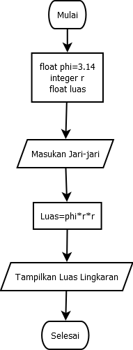
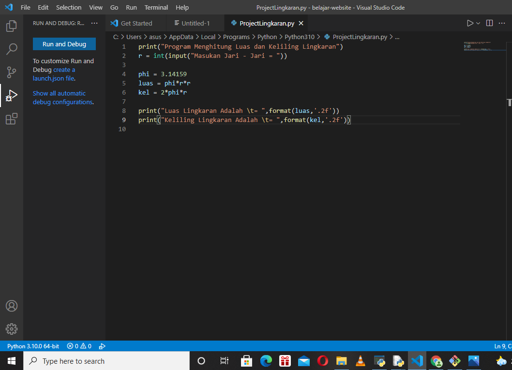
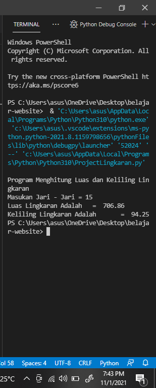

# Lingkaran
## project program lingkaran
### bentuk flowchart dari program menghitung luas dan keliling lingkaran
silahkan diperhatikan baik baik cara membuat flowhart lingkarang dibawah ini!

### menggunakan fungsi math
dengan kode math.pi dengan nilai 3.14

### ini adalah hasil dari luas dan keliling lingkaran

